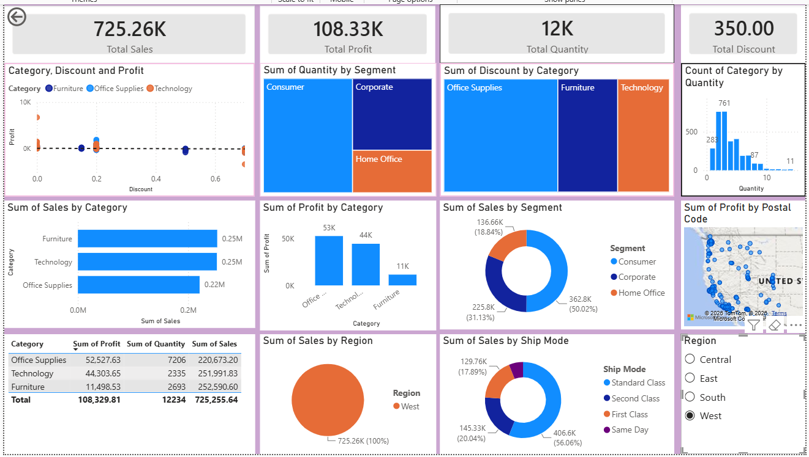

# Superstore-Sales-Analysis
Superstore sales data analysis using Python for data cleaning, SQL for analysis, and Power BI for creating an interactive dashboard.


# 📊 Sales Dashboard Project
https://github.com/Rajaneeshkumar-code/Superstore-Sales-Analysis

An end-to-end Data Analytics project that analyzes Superstore sales data using **Python**, **SQL**, and **Power BI**. The project focuses on data cleaning, business analysis, and interactive dashboard development to generate actionable business insights.



---

## 🎯 Project Objective

The goal of this project is to analyze sales performance and answer key business questions such as:

- Which products generate the highest sales?
- Which categories are the most profitable?
- Which customer segments contribute the most revenue?
- How do sales vary across regions?
- What are the monthly sales trends?
- How does shipping mode affect sales performance?

---

## 🛠️ Tools & Technologies

| Tool | Purpose |
|------|---------|
| Python | Data Cleaning & Preprocessing |
| Pandas | Data Manipulation |
| NumPy | Numerical Operations |
| SQL (PostgreSQL) | Data Analysis |
| Power BI | Interactive Dashboard |
| GitHub | Project Version Control |

---

## 📂 Project Structure

```text
Sales-Dashboard-Project/
│
├── Dataset/
│
├── SQL Queries/
│
├── Dashboard/
│
├── Screenshots/
│
└── superstore_data_cleaning.ipynb/
|__ Readme.md

```

---

## 📊 Dashboard Features

### KPI Cards
- Total Sales
- Total Profit
- Total Quantity Sold
- Total Discount

### Business Analysis
- Sales by Category
- Profit by Category
- Sales by Segment
- Sales by Region
- Sales by Ship Mode
- Profit Distribution by Postal Code
- Category-wise Discount Analysis

### Interactive Filters
- Region Slicer
- Dynamic Cross-Filtering

---

## 🧹 Data Cleaning Process (Python)

The dataset was cleaned using Python by performing:

- Handling missing values
- Removing duplicate records
- Correcting data types
- Standardizing column names
- Data validation checks
- Exploratory Data Analysis (EDA)

---

## 🗄️ SQL Analysis

SQL queries were written to extract business insights, including:

### Sales Analysis
- Total Sales
- Total Profit
- Total Quantity

### Category Analysis
- Sales by Category
- Profit by Category
- Discount by Category

### Customer Analysis
- Sales by Segment
- Customer Contribution Analysis

### Regional Analysis
- Sales by Region
- Profit by Region

---

## 📈 Key Insights

- Technology category generated strong profits.
- Consumer segment contributed the highest sales.
- Standard Class was the most frequently used shipping mode.
- Regional analysis helped identify top-performing markets.
- Discount levels impacted profitability across categories.

---

## 📷 Dashboard Preview

### Sales Dashboard


---

## 🚀 How to Use

### Step 1: Clone Repository
```bash
git clone https://github.com/Rajaneeshkumar-code/Superstore-Sales-Analysis.git
```

### Step 2: Open Power BI Dashboard
```text
Dashboard/SampleSuperstore.pbix
```

### Step 3: Run SQL Queries
Execute SQL scripts from:
```text
SQL Queries/
```

### Step 4: Review Dataset
Dataset files are available in:
```text
Dataset/
```

---

## 📌 Skills Demonstrated

- Data Cleaning
- Data Analysis
- SQL Querying
- Data Visualization
- Business Intelligence
- Dashboard Design
- Power BI Development

---

## 👨‍💻 Author

**Rajaneesh Kumar**
Aspiring Data Analyst | SQL | Python | Power BI | Machine Learning

---

## ⭐ If you found this project useful, please give it a star on GitHub!
